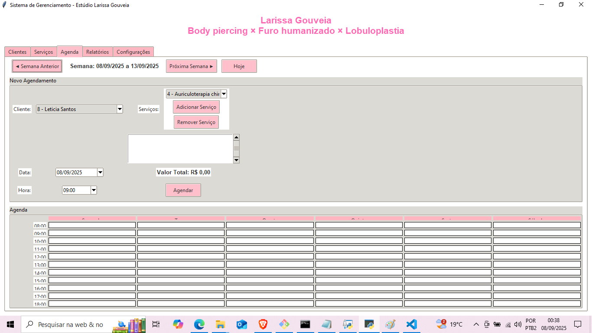
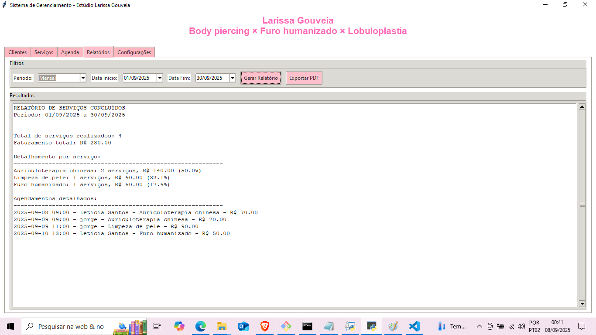
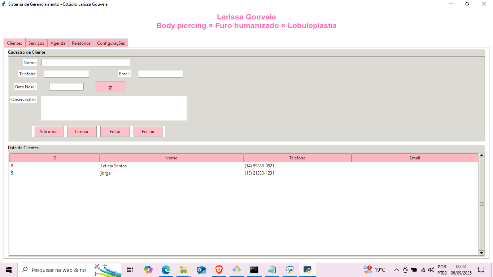
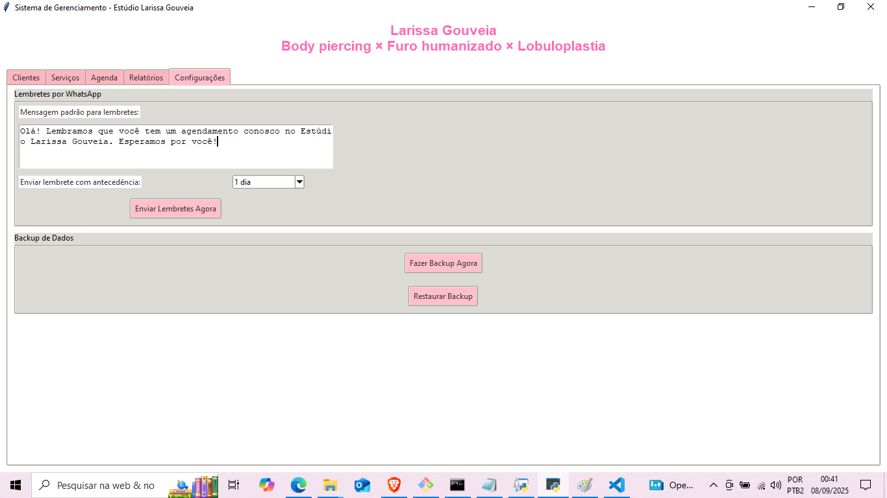

# 🖊️ Sistema de Gerenciamento - Estúdio Larissa Gouveia

<p align="center">
  
  
  
</p>

Sistema completo de gerenciamento desenvolvido especialmente para estúdios de estética, com foco em piercings, furo humanizado e procedimentos estéticos.

## ✨ Funcionalidades Principais

### 📋 Gestão de Clientes
- **Cadastro completo** de clientes com dados pessoais
- **Histórico de serviços** realizados
- **Contato integrado** (telefone e e-mail)
- **Anotações personalizadas** para cada cliente

### 💼 Gestão de Serviços
- **Catálogo de serviços** personalizável
- **Controle de preços** e duração dos procedimentos
- **Flexibilidade** para adicionar/editar/remover serviços
- **Sistema de descontos** integrado

### 📅 Agenda Inteligente
- **Visualização semanal** dos agendamentos
- **Controle de horários** disponíveis
- **Marcação de serviços** com múltiplos procedimentos
- **Status visual** (agendado, concluído, cancelado)

### 📊 Relatórios Avançados
- **Relatórios financeiros** diários, semanais e mensais
- **Análise por serviços** mais lucrativos
- **Exportação para PDF** profissional
- **Estatísticas** de desempenho do negócio

### 📱 Integrações
- **Lembretes automáticos** via WhatsApp
- **Backup e restauração** de dados
- **Sistema offline** que não depende de internet

## 🖼️ Capturas de Tela

| Tela de Agendamentos | Relatórios Financeiros |
|----------------------|-----------------------|
|  |  |

| Gestão de Clientes | Configurações |
|-------------------|---------------|
|  |  |

## 🚀 Como Executar o Sistema

### Pré-requisitos
- Python 3.8 ou superior
- Pip (gerenciador de pacotes do Python)

### Instalação

1. **Clone o repositório**
```bash
git clone https://github.com/seuusuario/sistema-estudio-lg.git
cd sistema-estudio-lg

## 📜 Licença

Este software é disponibilizado **apenas para fins educacionais e de estudo**.

### ✅ Permitido:
- Estudar e aprender com o código
- Uso pessoal não-comercial

### ❌ Estritamente Proibido:
- Venda, distribuição comercial ou licenciamento
- Uso em produtos ou serviços comerciais
- Redistribuição como produto próprio

### 💼 Licenciamento Comercial:
Para uso comercial, entre em contato para adquirir uma licença:
- **Email**: honoriohneto@gmail.com
- **Valor**: Sob consulta

**Infrações serão tratadas judicialmente conforme Lei 9.610/98.**
